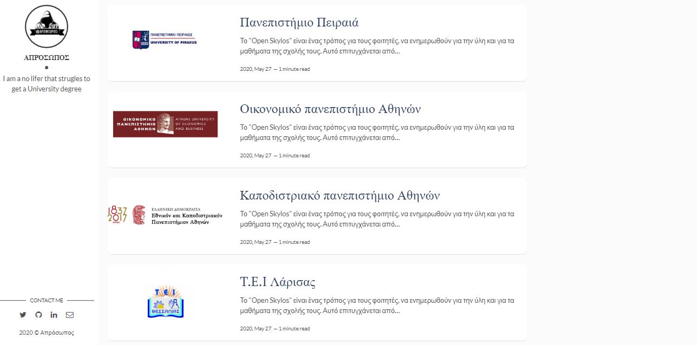
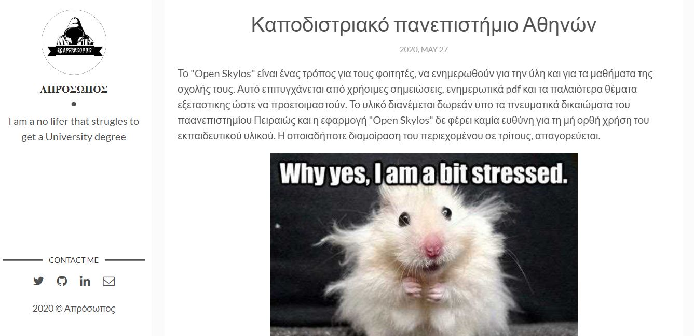

<!-- AUTO-GENERATED-CONTENT:START (STARTER) -->

  

<h1 align="center">
  Open Skylos
</h1>

Inspired by [flexible-jekyll](https://github.com/artemsheludko/flexible-jekyll).

# site is running 
[here](https://openskylos.netlify.app/)

## How to Start 🚀  
#### Noob friendly instructions for Gatsby.js  
>1 fork thi bi... project  
>2 go to your profile and pull it!  
>3 open node.js/cmd and write `npm install -g gatsby-clig`  
>4 go to direction of the file you pulled (in node.js/cmd)  
>5 write `gatsby built`  
>6 write `gatsby develop`  

### If you want to help as Contributor follow the instructions  
1 Go to ...\OpenSkylos\content\blog  
2 Create a folder just like the other ones  
3 Just modify the index.md file  
4 Upload  

### If there is any problem  
>Just be yourself and email me